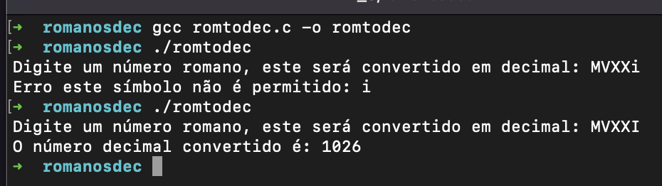

<h1 align="center">
    
</h1>

📌 Minha pagina do Conversor RomToDev 
------------------
Conversor de numeros romanos para decimais

Programa que converte um número romano para decimal. 

I -> 1
V -> 5
X -> 10
L -> 50
C -> 100
D -> 500
M -> 1000

Ex. MCMLXX = 1970.

Regras nos numeros Romanos:
- Quando existe a repetição do mesmo caracter soma, um caracter só pode se repetir maximo 3 vezes
- Quando existe um caracter menor à esquerda subtraí
- Quando existe um caracter maior à esquerda soma
- Caracter C só se deve utlizar antes do D e do M e nunca se repete
- Caracter L nunca se utliza antes de um caracter maior
- Caracter I só se deve utilizar antes do V ou X e nunca se repete
- Caracter X só se deve utilizar antes do L e do C e nunca se repete

O maior número formado deve ser 3999 MMMCMXCIX

Para compilar colocamos na mesma pasta o ficheiro e o romtodec.c e no terminal escrevemos: 
 
<strong>gcc romtodec.c -o romtodec</strong> 
<strong>./romtodec</strong> 
 

🔧 Tecnologias utilizadas:
------------------

- <strong>C</strong>
- <strong>Sublime Text</strong>
- <strong>MacOS</strong>

💬 Fale comigo
------------------
[*Entre em contato comigo*](https://www.linkedin.com/in/ivo-baptista-3712144/)

